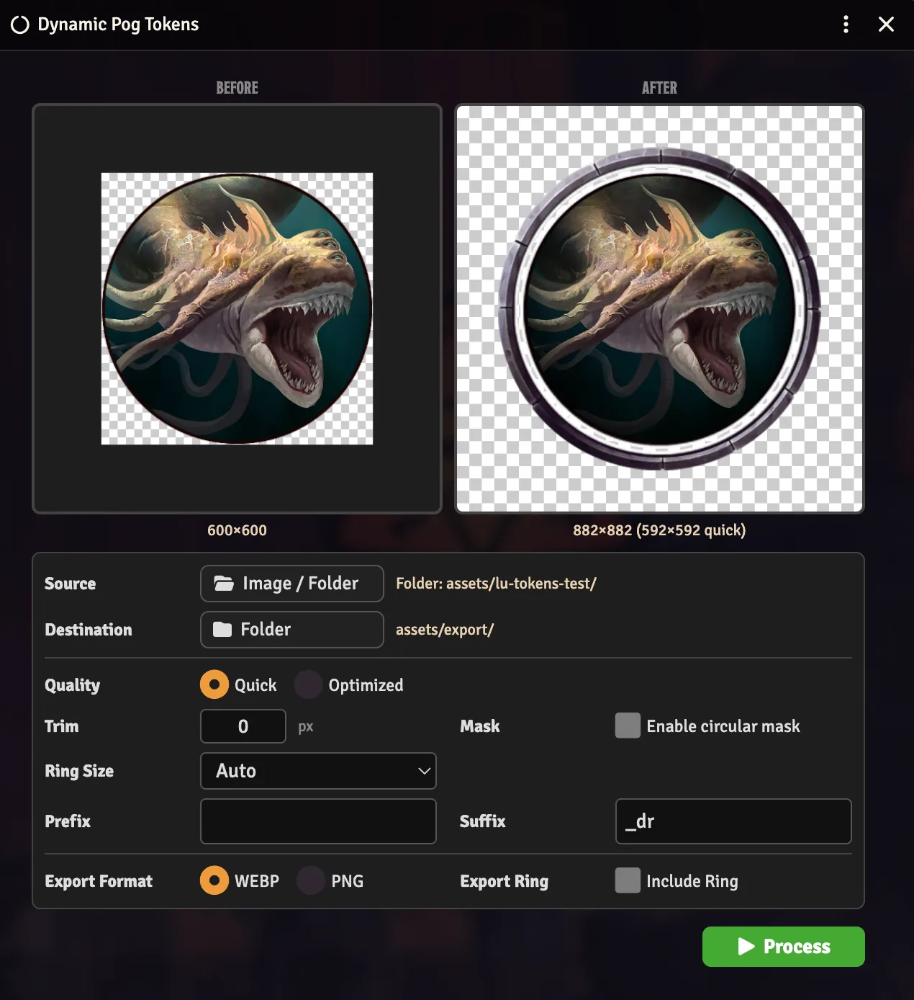

# Dynamic Pog Tokens

> **⚠️ Disclaimer:** This module was created by an AI coding agent (Hephaestus, via Hermes Agent) under the direction of Jon Michaels. While tested and functional, users should verify behavior in their own games before relying on it in critical sessions.

Batch-process pog-style (circular) tokens to add support for **Foundry VTT Dynamic Token Rings**. The final token will have the subject centered and 2/3 of the size with a transparent background that extends the remaining 1/3 of the size. Trim tokens to remove existing rings. Add to mask to JPEGs and other tokens without a transparent background. Resize with high-quality Lanczos3 scaling via pica.

## Features

| Feature | Description |
|---------|-------------|
| **Source Formats** | JPEG, WEBP, PNG |
| **Batch processing** | Process multiple pog-style tokens at once |
| **Lanczos3 scaling** | High-quality image resizing via pica |
| **Trim & mask** | Automatic border trimming and circular/ring masking for Dynamic Rings |
| **Before/After preview** | Side-by-side comparison of original and processed tokens |
| **WEBP & PNG export** | Choose between modern WEBP or classic PNG output |
| **ApplicationV2 UI** | Modern Foundry VTT ApplicationV2 interface with Handlebars templates |

## Installation

**In Foundry VTT:**
1. Go to **Add-on Modules** → **Install Module**
2. Paste the manifest URL: `https://github.com/jonmichaels/dynamic-pog-tokens/releases/latest/download/module.json`
3. Click **Install**

**Manual:**
Download the [latest release](https://github.com/jonmichaels/dynamic-pog-tokens/releases) and extract to `Data/modules/dynamic-pog-tokens/`.

## Requirements

- **Foundry VTT** v13 or v14
- Compatible with all systems

## Release Notes

### v1.0.1

- Fixed the scene controls integration for Foundry v13/v14 by using the object-style `getSceneControlButtons` API (`controls.tokens.tools`) instead of the older array-style lookup.
- Added a regression test to prevent the toolbar button hook from reintroducing `controls.find(...)`.

## How It Works

1. Activate the module in your world
2. Click the **Dynamic Pog Tokens** button in the Actor sidebar
3. Select one pog-style token image or a entire folder full of them.
4. Configure processing options (quality, trim, mask, ring size, export format)
5. Click **Process** to batch-convert tokens to Dynamic Ring-compatible format

The module uses pica for high-quality Lanczos3 image resizing and the Canvas API for masking and compositing.

## Credits

[Dynamic Pog Tokens](https://github.com/jonmichaels/dynamic-pog-tokens) by Jon Michaels. Coded by Hephaestus, a Hermes AI-Coding Agent.

## License

This module is available under the [MIT License](LICENSE).
